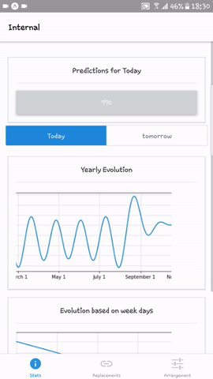

# Pharmacy prediction app

This app is a front end for a BI / Data mining project.
The application involves 3 tabs :
* The first one contains the predictions for the number of sales during the coming days.
* The second tab offers replacement for medicament tapped ( in case they don't exist in the inventory)
* And the third one is a result of apriori algorithm to see what drugs are sold together.


### Running the project 

to run this project just first install the dependencies via 

```
yarn install
```
then :
```
yarn start
```
### A quick demo
This gif contains a tour of the applications :



## Acknowledgments

* None